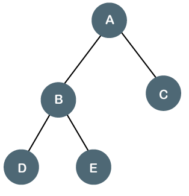

遍歷方法
* 迭代方法：
  * queue：一個陣列，在迭代中，透過 push 新增工作，透過 shift 進行工作。
  * stack：一個陣列，在迭代中，透過 push 新增工作，透過 pop 進行工作。
* 遞迴方法：透過函數的遞迴呼叫來進行 stack 迭代方法。

# Breadth First Search，BFS



> $A \rightarrow B \rightarrow C \rightarrow D \rightarrow E$

```js
const bfs = (root) => {
  if(!root) return

  const queue = [root]
  while (queue.length) {
    const item = queue.shift()

    console.log(item.val)

    if(item.left) queue.push(item.left)
    if(item.right) queue.push(item.right)
  }
}
```

# Depth First Search，DFS

## Pre-Order


> $A \rightarrow B \rightarrow D \rightarrow E \rightarrow C$

迭代方法：

```js
const perOrderDfs = (root) => {
  if (!root) return

  const stack = [root]
  while (stack.length) {
    const item = stack.pop()

    console.log(item.val)

    if(item.right) stack.push(item.right) 
    if(item.left) stack.push(item.left)
  }
}
```

遞迴方法：

```js
const perOrderDfs = (node) => {
  if (!node) return

  console.log(node.val)

  if(node.left) preOrderDfs(node.left)
  if(node.right) preOrderDfs(node.right)
}
```

## In-Order


> $D \rightarrow B \rightarrow E \rightarrow A \rightarrow C$

迭代方法：

```js
const inOrderDfs = (root) => {
  if (!root) return

  const stack = []
  let current = root
  while (stack.length || current) {
    if (current) {
      stack.push(current)
      current = current.left
    } else {
      const item = stack.pop()

      console.log(item.val)
    
      current = item.right
    }
  }
}
```

遞迴方法：

```js
const inOrderDfs = (node) => {
  if(!root) return

  if(node.left) inOrderDfs(node.left)

  console.log(node.val)

  if(node.right) inOrderDfs(node.right)
}
```

## Post-Order


> $D \rightarrow E \rightarrow B \rightarrow C \rightarrow A$

迭代方法：

```js
const postOrderDfs = (root) => {
  if (!root) return

  const stack = [root]
  while (stack.length) {
    const item = stack.pop()
    if (!item) continue
    if (!item.val) console.log(item)
    stack.push(item.val)
    stack.push(item.right)
    stack.push(item.left)
  } 
  return result
}
```

遞迴方法：

```js
const postOrderDfs = (node) => {
  if(!root) return

  if(node.left) postOrderDfs(node.left)
  if(node.right) postOrderDfs(node.right)

  console.log(node.val)
}
```